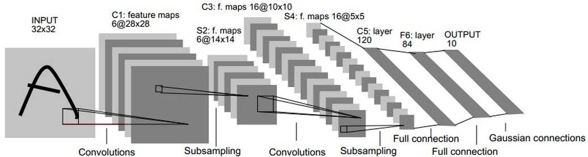

# lenet
使用LeNet，对[CIFAR-10](https://www.cs.toronto.edu/~kriz/cifar.html)数据集进行图像分类。

## LeNet 简介

LeNet包含七层，不包括输入，每一层都包含可训练参数（权重），输入数据是32\*32像素的图像。

层C1是具有六个5\*5的卷积核的卷积层（convolution），特征映射的大小为28\*28，这样可以防止输入图像的信息掉出卷积核边界。C1包含156个可训练参数和122304个连接。

层S2是输出6个大小为14\*14的特征图的子采样层（subsampling/pooling）。每个特征地图中的每个单元连接到C1中的对应特征地图中的2\*2个邻域。S2中单位的四个输入相加，然后乘以可训练系数（权重），然后加到可训练偏差（bias）。结果通过S形函数传递。由于2\*2个感受域不重叠，因此S2中的特征图只有C1中的特征图的一半行数和列数。S2层有12个可训练参数和5880个连接。

层C3是具有16个5\*5的卷积核的卷积层。前六个C3特征图的输入是S2中的三个特征图的每个连续子集，接下来的六个特征图的输入则来自四个连续子集的输入，接下来的三个特征图的输入来自不连续的四个子集。最后，最后一个特征图的输入来自S2所有特征图。C3层有1516个可训练参数和156000个连接。

层S4是与S2类似，大小为2\*2，输出为16个5\*5的特征图。S4层有32个可训练参数和2000个连接。

层C5是具有120个大小为5\*5的卷积核的卷积层。每个单元连接到S4的所有16个特征图上的5\*5邻域。这里，因为S4的特征图大小也是5\*5，所以C5的输出大小是1\*1。因此S4和C5之间是完全连接的。C5被标记为卷积层，而不是完全连接的层，是因为如果LeNet输入变得更大而其结构保持不变，则其输出大小会大于1\*1，即不是完全连接的层了。C5层有48120个可训练连接。

F6层完全连接到C5，输出84张特征图。它有10164个可训练参数。这里84与输出层OUTPUT的设计有关。
